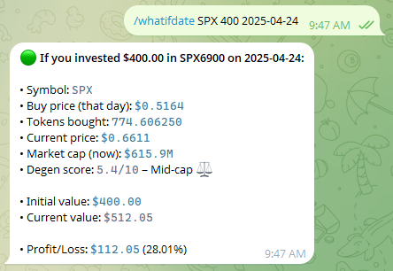

🚀 What-If Profit/Loss Bot

A lightweight Telegram bot that helps you explore crypto “what if” scenarios, check ATH stats, and track a simple manual portfolio — all powered by public crypto APIs.

⭐ Features
🔮 What-If Historical Calculation
/whatifdate SYMBOL USD_AMOUNT YYYY-MM-DD

See how much your investment would be worth today if you had invested a given USD amount in a token on a past date.

➕ Add a Position
/addpos SYMBOL AMOUNT BUY_PRICE

Add a manual position to your on-bot portfolio.
Useful if you want to track PnL without connecting a wallet.

📊 Portfolio Overview
/portfolio

Shows all your added positions with:

current price

current value

initial cost

PnL ($ and %)

total portfolio PnL

💎 ATH Lookup
/ath SYMBOL

Get:

All-time-high price

ATH date

Current price

Market cap (formatted automatically)

“Degen score” (how far from ATH)

🗑️ Clear Portfolio
/clear

Deletes your entire saved portfolio.

❌ Remove a Single Token
/remove SYMBOL

Remove all positions for a specific token.

🌅 Good Morning
/gm

Sends a fun degen-style GM message 😄

🖼️ Screenshots

(Add your images here — GitHub automatically displays them)

For example:

## 🚀 Bot Launch

## 💎 ATH Example

## 📊 Portfolio Example

## 🔮 What-If Example

⚙️ Setup
1. Clone the repo
git clone https://github.com/legacyindeed/Telegram_Crypto-Bot.git
cd Telegram_Crypto-Bot

2. (Optional) Create a virtual environment
python -m venv .venv
source .venv/bin/activate     # Mac/Linux
.venv\Scripts\activate        # Windows

3. Install dependencies
pip install -r requirements.txt

4. Add your Telegram Bot Token

PowerShell (Windows):

$env:BOT_TOKEN="YOUR_TELEGRAM_BOT_TOKEN_HERE"

bash (Mac/Linux):

export BOT_TOKEN="YOUR_TELEGRAM_BOT_TOKEN_HERE"

5. Run the bot
python bot.py

🧪 Optional: Environment File

If you prefer using an .env file, create .env.example:

BOT_TOKEN=YOUR_TELEGRAM_BOT_TOKEN_HERE

Then create your own .env and fill in your real token.

📘 About

This project was built to experiment with crypto price history, PnL calculations, and simple Telegram bot tools.
It relies solely on public APIs, stores no personal data, and uses an easy-to-understand SQLite structure for positions.

If you like the project, consider ⭐ starring the repo!
